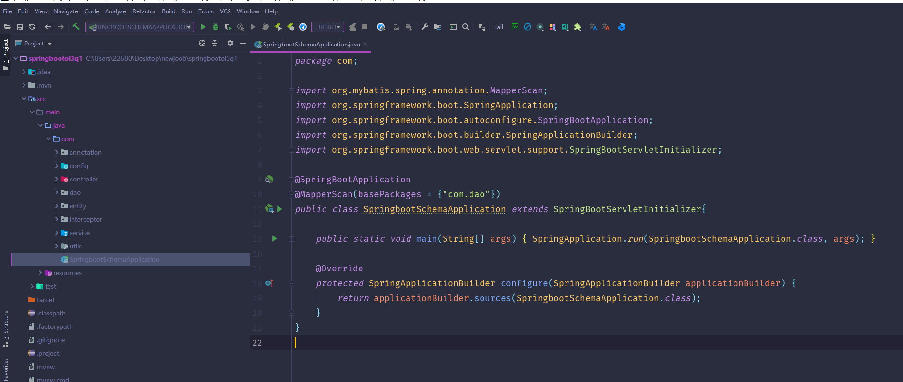

# 基于SpringBoot的秒杀系统

#### 介绍

秒杀系统是一种高效的在线购物平台，基于SpringBoot框架开发，旨在为用户提供快速、便捷的购物体验，并为商家提供高效的商品促销工具。秒杀系统特别适用于大促销活动，能够在短时间内吸引大量用户参与购买，提升商品销量。随着电子商务的迅猛发展，用户对快速购物、及时优惠的需求日益增加，传统的购物系统往往难以应对瞬时高并发的访问请求，这为秒杀系统的开发提供了广阔的市场背景和现实需求。

#### 技术栈

后端技术栈：Springboot+Mysql+Maven

前端技术栈：Vue+Html+Css+Javascript+ElementUI

开发工具：Idea+Vscode+Navicate

#### 系统功能介绍

管理员角色：

个人中心：管理员可以在个人中心查看和修改个人信息，设置系统通知和消息提醒等。  
用户管理：包括用户的注册、登录、信息修改等操作的管理，支持查看用户列表、删除用户、禁用用户等功能。  
商品类型管理：管理商品的分类信息，支持添加、修改和删除商品类型，方便商品信息的管理和检索。  
商品信息管理：管理员可以添加、修改、删除商品信息，管理商品库存，设置商品的秒杀活动信息。  
系统管理：系统参数设置、日志管理、权限分配等功能，确保系统安全稳定运行。    
订单管理：查看和处理用户的订单信息，包括订单的生成、支付、发货、退货等操作，确保订单处理的及时性和准确性。  

用户角色：

商品信息：用户可以浏览和搜索商品信息，查看商品的详细介绍、库存情况、价格等。  
购物活动：用户可以参与平台的秒杀活动，抢购限时优惠商品，查看秒杀活动的时间安排和商品信息。  
个人中心：用户可以查看和修改个人信息，查看购买记录、收藏商品、设置通知提醒等。  
购物车：用户可以将商品加入购物车，进行批量购买，查看购物车中的商品信息和总价。  
在线客服：提供即时的在线客服支持，用户可以咨询商品信息、订单状态、售后服务等问题，提升用户体验。  

#### 系统作用

秒杀系统的主要作用在于提升商品的销量和用户的购物体验。通过秒杀活动，商家可以在短时间内吸引大量用户参与购买，增加商品的曝光率和销量。系统的高并发处理能力和快速响应机制，确保用户在秒杀活动中的良好体验，减少因系统拥堵导致的用户流失。

对于用户而言，秒杀系统提供了一个高效、便捷的购物平台。用户可以通过参与秒杀活动，购买到价格优惠的商品，享受快速的购物体验。系统的在线客服功能，提供即时的咨询服务，解决用户在购物过程中遇到的问题，提升用户满意度。

#### 系统功能截图

代码结构

数据库表

登录

前台页面首页

商品信息

购物活动

个人中心

购物车

在线客服

管理员端商品详情

订单管理

购物活动

#### 总结

秒杀系统作为一种高效的电子商务平台，针对现代用户快速购物和优惠购物的需求，提供了全方位的解决方案。系统通过精心设计的功能模块，满足了管理员和用户的不同需求，确保系统的高效运行和良好的用户体验。

在实际应用中，秒杀系统不仅提升了商家的商品销量和品牌曝光度，还增强了用户的购物体验和满意度。尽管面临高并发处理、订单管理、库存管理等多重挑战，但通过合理的技术架构和优化策略，秒杀系统有效解决了这些问题，展现了其在电子商务领域的巨大潜力和广泛应用前景。

随着电子商务的发展和用户需求的不断变化，秒杀系统也需要不断升级和优化，适应新的市场需求和技术环境。未来，秒杀系统将继续在提升用户购物体验、优化系统性能、拓展功能模块等方面进行探索和创新，进一步巩固其在电子商务领域的竞争优势。

#### 使用说明

创建数据库，执行数据库脚本 修改jdbc数据库连接参数 下载安装maven依赖jar 启动idea中的springboot项目

后台地址
http://localhost:8080/springbootol3q1/admin/dist/index.html

管理员  abo 密码 abo

前台地址：http://localhost:8080/springbootol3q1/front/index.html